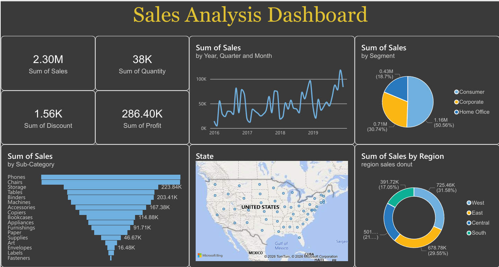

# 📊 Sales Analysis Dashboard using Power BI

## Project Overview

The Sales Analysis Dashboard is an interactive Business Intelligence solution developed using Microsoft Power BI. It transforms raw sales data into meaningful insights through dynamic visualizations, KPIs, and filters. The dashboard helps analyze sales performance, profitability, customer behavior, and product performance, enabling data-driven business decisions.

---

## Objectives

- Analyze overall sales performance.
- Monitor revenue and profit trends.
- Identify top-performing products and categories.
- Compare sales across different regions.
- Track monthly sales performance.
- Build an interactive dashboard for business insights.
- Support data-driven decision-making.

---

## Dataset

The dashboard is built using a sales dataset containing transactional business records.

### Dataset includes:

- Order ID
- Order Date
- Customer Name
- Product Name
- Product Category
- Region
- Sales
- Quantity
- Profit
- Discount

---

## Dashboard Preview

### Main Dashboard



---

## Key Performance Indicators (KPIs)

The dashboard displays the following KPIs:

- Total Sales
- Total Orders
- Total Profit
- Total Quantity Sold
- Average Sales

---

## Visualizations

The dashboard includes interactive visualizations such as:

- Monthly Sales Trend
- Sales by Region
- Sales by Product Category
- Top Performing Products
- Profit Analysis
- Customer Analysis
- Interactive Filters and Slicers

---

## Business Insights

Some key insights obtained from the dashboard include:

- Identified the highest-performing product categories.
- Compared sales performance across different regions.
- Monitored monthly sales growth and seasonal trends.
- Analyzed profit contribution by product category.
- Evaluated customer purchasing patterns.
- Enabled interactive exploration through slicers and filters.

---

## Tools & Technologies Used

- Microsoft Power BI
- Power Query
- DAX (Data Analysis Expressions)
- Microsoft Excel / CSV Dataset

---

## How to Open the Project

1. Clone or download this repository.
2. Install **Microsoft Power BI Desktop**.
3. Open the `Sales Analysis Dashboard.pbix` file.
4. Refresh the dataset if required.
5. Explore the dashboard using filters and slicers.

---

## Learning Outcomes

Through this project, I gained practical experience in:

- Data Cleaning using Power Query
- Data Modeling
- DAX Measures and Calculations
- KPI Development
- Interactive Dashboard Design
- Business Intelligence
- Data Visualization
- Business Performance Analysis

---

## Repository Structure

```
Sales-Analysis-Dashboard/
│
├── Dashboard.pbix
├── dataset/
│   └── sales_dataset.csv
├── screenshots/
│   └── dashboard.png
├── README.md
└── Sales Analysis Report.pdf
```

---

## 👩‍💻 Author

**Hafsa Asif**

Computer Science Student

- 📧 Email: asifhafsa62@gmail.com
- 💼 LinkedIn: https://www.linkedin.com/in/hafsa-asif-783a23290/
- 💻 GitHub: https://github.com/hafsa-cs

---

⭐ If you found this project helpful, consider giving it a star!
